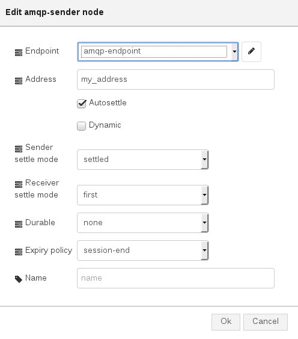

# AMQP Sender

This is node is useful in order to create an AMQP sender for connecting to an AMQP container (i.e. broker, AMQP server, AMQP router, ...) and start to send messages.

## Configuration

The configuration allows to specify following parameters :

* **_Endpoint_** : the AMQP endpoint configuration node which specifies the AMQP container to connect with this sender;
* **_Address_** : the AMQP address as target for this sender node;
* **_Autosettle_** : this flag specifies if the sent messages should be automatically settled once the peer settles them. Defaults to true;
* **_Dynamic_** : this flag specifies a request for the receiving peer to dynamically create a node at the target;
* **_Sender settle mode_** : it specifies the sender settle mode with following possibile values _unsettled_, _settled_ and _mixed_ as described by the AMQP 1.0 specification;
* **_Receiver settle mode_** : it specifies the receiver settle mode with following possibile values _first_ and _second_ as described by the AMQP 1.0 specification;
* **_Durable_** : it specifies what state of the terminus will be retained durably: the state of durable messages (_unsettled_state_ value), only existence and configuration of the terminus (_configuration_ value), or no state at all (_none_ value);
* **_Expiry policy_** : expiry policy of the target (see AMQP 1.0 specification for more information);
* **_Name_** : name used to identify the node inside the Node-RED flow;

## Input/Output

This node provides following input and output :

* **_input_** : a "Node-RED" message with _msg.payload = <AMQP message>_ with a JSON format containing body and optional header, properties, application_properties and so on. This is the message to send;
* **_output_** : a "Node-RED" message with _msg.delivery = <AMQP delivery>_ with a JSON format containing information about delivery on sent message (i.e. "tag"). The other field is _msg.deliveryStatus = <AMQP delivery status>_ with accepted, rejected, released and modified as possible values;
